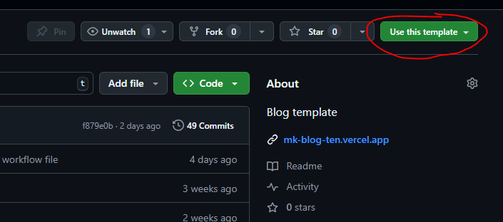

# Documentation

## Table of Contents

1. [About](#about)
2. [How to set up a blog using this repo](#clone-process)
    1. [Step 1 - Clone this repo](#clone)
    2. [Step 2 - Set up a Vercel site](#vercel)
    3. [Step 3 - Nuxt Studio](#studio)
    4. [Step 4 (optional) - Updates](#updates)
3. [Configuration](#config)
    1. [Caveats](#caveat)
    2. [Articles](#article)
    3. [Media](#media)
4. [Contributing](#contribute)
5. [Local Development](#local)
6. [License](#license)

## About <a name="about"></a>

This is not a CMS tool, like Wordpress or whatever. This is a WIP blog repo that needs to be duplicated for each blog. If you want to be able to get updates you will have to clone this repo and keep a dependency on the original from the fork. Below is a step by step guide.

You will need the a [Github](https://github.com/) account, a [Nuxt Studio](https://nuxt.studio/) account and a [Vercel](https://vercel.com/) account, or any other hosting provider of your choice. Note that I will only support bugfixes on Vercel deployments.

You will also have to connect Vercel to your Github Account.

## How to set up a blog using this repo <a name="clone-process"></a>

### Step 1 - Clone this repo <a name="clone"></a>

Head over to this repo on [GitHub](https://github.com/martiensk/mk-blog). Find the _Use this template_ button at the top right (at time of writing) and hit that. Select _Create a new repository_.



Give it a name and punch that _Create repository_ button.

### Step 2 - Set up a Vercel site <a name="vercel"></a>

Go to Vercel and add a new project. Select your shiny new repository from the list.

> _**If you cant find the repo in the list, head over to GitHub and go to your profile settings. Go to Integrations/Applications, find Vercel and hit Configure. Select your repo from the list and save.**_

Once the _Configure Project_ screen pops up you can simply hit _Deploy_ without making any configuration changes.

Once the _Configure Project_ screen pops up find the section title _Environment Variables_ and add the following:

| Key                  | Value               |
| -------------------- | ------------------- |
| NUXT_PUBLIC_SITE_URL | You website address |

Make sure you add your custom domain name to Vercel and follow the steps to configure your DNS. Once done you can update the above with your custom domain.

### Step 3 - Nuxt Studio <a name="studio"></a>

Go to Nuxt Studio and hit the _New project_ button.
Select the _Import a Nuxt project_ option. Select your repo from the list.

> _**If you cant find the repo in the list, head over to GitHub and go to your profile settings. Go to Integrations/Applications, find Nuxt Studio and hit Configure. Select your repo from the list and save.**_

You can now rename your project if you'd like. For the project location, select the single dot ( **.** ) and click _Import repository_.

Now head over to the _Deploy_ option. Select _Selfhosting_ and add either the Vercel generated URL or you custom domain name. Select Save.

This is the minimal required setup anf you can now delete the default articles and add your own, manage your media and configure your project.

### Step 4 (optional) - Updates <a name="updates"></a>

Configuring updates is a bit more of a technical task. This is entirely optional but recommended if you want to see the latest themes, or get the latest updates and security patches.

First you need to open a terminal and clone your repository locally.

```sh
git clone [Your repo]
cd ./[your repo folder]
```

Next you will have to add the original repo as a remote and merge changes from it. I have simplified this process as an npm command, so simply run

```sh
npm run update
```

## Configuration <a name="config"></a>

The configuration is fairly straight forward with almost all options being configurable via **Nuxt Studio**, in the _Data_ section.

### Caveats <a name="caveat"></a>

The only caveat here is that you need to add the environment variable for your website URL in Vercel as described above. This is important for SEO, as this is the URL that will be used in generated rich data snippets and your sitemap.

### Articles <a name="article"></a>

Articles are written in markdown. Using Nuxt Studio you are able to edit them in a rich text editor, which will in turn convert it to the markdown code.

If using the rich editor you need to add the following section at the top, under page settings:

```
title: required
description: required
image: required
author:
  name: optional
  avatar: optional
date: optional
category: optional
```

If you are editing the markdown directly, add the following block at the top:

```md
---
title: required
description: required
image: required
author:
    name: optional
    avatar: optional
date: optional
category: optional
---
```

I have indicated which options are required and which are optional. For you own sanity, have a look at the example articles included.

### Media

Save images in the appropriate folders in **Nuxt Studio**. You can overwrite any images already there. You might want to do this to replace your favicon. (I use https://realfavicongenerator.net/ to generate mine.)

## Contributing <a name="contribute"></a>

We welcome contributions to improve this project! Here's how you can help:

### Getting Started

1. Fork the repository
2. Clone your fork: `git clone https://github.com/martiensk/mk-blog`
3. Create a new branch: `git checkout -b feature/your-feature-name`

### Making Changes

1. Make your changes in the new branch
2. Test your changes thoroughly
3. Commit your changes: `git commit -m "Add a descriptive commit message"`
4. Push to the branch: `git push origin feature/your-feature-name`

### Submitting a Pull Request

1. Go to the original repository on GitHub
2. Click the "New pull request" button
3. Select your fork and the branch you created
4. Fill in the PR template with all relevant information
5. Submit the pull request

### Code Style and Standards

-   Follow the existing code style in the project
-   Write clear, commented, and testable code
-   Update documentation for any new features or changes

### Reporting Issues

-   Use the GitHub Issues tab to report bugs or suggest features
-   Provide a clear title and description
-   Include steps to reproduce for bugs
-   Add screenshots if applicable

### Staying Updated

To keep your fork up to date with the main repository:

```bash
git remote add upstream https://github.com/original-owner/original-repo.git
git fetch upstream
git merge upstream/main
git push origin main
```

### Code of Conduct

Please note that this project is released with a [Contributor Code of Conduct](CODE_OF_CONDUCT.md). By participating in this project you agree to abide by its terms.

Thank you for contributing to our project! 🎉

## Local development <a name="local"></a>

Since you have created your own repo based off this template you are free to develop it further however you see fit.

### Setup

Make sure to install the dependencies:

```bash
# npm
npm install
```

### Development Server

Start the development server on `http://localhost:3000`:

```bash
# npm
npm run dev
```

### Production

Build the application for production:

```bash
# npm
npm run build
```

## License <a name="license"></a>

This project is licensed under the MIT License - see the [LICENSE](LICENSE) file for details.
